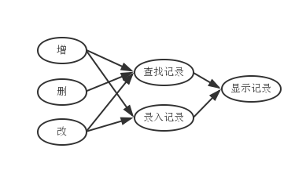

---
layout: post
category : CodeExp
tagline: "C语言大作业-学生成绩管理系统"
tags : [C]
---


    当大四的我重写大一时的C语言大作业（其二）

看不惯3年前写的那程序，实在没法小改了。于是准备重新写一个。首先，我们要做的是明确要写什么程序，明确程序要实现的具体功能。回顾一下题目要求：实现一个可以增删改查记录的学生成绩管理系统。

首先，分析需求，提出总体设计，设计主菜单

```C
    printf( "-菜单:\t"
            "1.查找\t"
            "2.追加\t"
            "3.删除\t"
            "4.修改\t"
            "5.排序\t"
            "6.显示\t"
            "7.保存\t"
            "0.退出\n"
            "输入序号:");
```

两个字符串可以自动衔接在一起，所以一行太长就这么办吧，个人觉得比网上、书上广为传播的一堆printf要好的多。下面分析这些功能之间的联系，如下面的图所示（如果你学了软件工程，可以简单地画个用例图以明确系统功能及联系，这里图省事画个简单的示意图）：



明确了需求，下面的问题就是如何实现了，实现的中心是数据结构设计，每个记录项是一个结构体，包含学生姓名、学生各科成绩、以及总分。

 * **为什么不加上学号，性别等？**性别对成绩管理系统不是重点。有了学号可以确保有一个唯一的标识，这里为了简单，假设我们的系统中名字就是唯一的，所以就不要学号了。
 * **为什么需要总分？**适当的冗余便于排序和显示等处理，否则每次都需要重新计算。如果要求显示平均分，那么也推荐数据结构里不存平均分而存总分，因为整型处理方便。

**小插曲-谈数据结构** 还记得范工程师的教导：一个C工程的好坏关键就看它的数据结构设计得怎么样。毕竟各种操作处理都是围绕着这玩意进行的，所以数据结构设计是非常重要的。记得以前做飞思卡尔智能车的时候，曾看到学长读取摄像头采集的数据的程序是将循环完全展开了的，开始不解，感觉很傻，后来顿悟，这是牺牲空间换取时间（运行速度）啊！没想到后来我很可笑的认为普通变量比数组变量更好，因为避免了索引！接着把数组都改成普通变量，遍历时一行一行复制，傻瓜地认为这也是牺牲空间换时间。等学了计算机组成原理 ，发现数组访问采用的是经过硬件优化了的指令，才感慨曾经不仅没有牺牲空间换时间，还牺牲了自己编写程序的时间，大伙维护程序的时间！**千万不要追求效率而牺牲程序可读性。（多么痛的领悟）**如果要研究如何提高效率的话，应该先学习相关知识，而不是凭主观臆断！

**扩展知识** 结构体设计的细节问题

问：

    typedef struct {
        char name[NAME_LEN];
        int  sum;
        char score[3];
    } Stu_t;

与

    typedef struct {
        int  sum;
        char score[3];
        char name[NAME_LEN];
    } Stu_t;

有区别吗？

【小插曲】这算是一个冷门知识，是我在大三时做网络协议分析器时才发现的，但是我想把网络协议反映在结构体中，从而可以直接将接受到的数据包转换为对应协议的数据结构的成员变量，直接采用访问结构体成员变量的方式就可以提取出数据包中的各个参数信息。结果发现不匹配，原因就是结构体的字节对齐原则。

>字节对齐原则
>结构体默认的字节对齐一般满足三个准则：
>1) 结构体变量的首地址能够被其最宽基本类型成员的大小所整除；
>2) 结构体每个成员相对于结构体首地址的偏移量（offset，即每个成员的起始地址）都是成员自身大小的整数倍，如有需要编译器会在成员之间加上填充字节（internal adding）；
>3) 结构体的总大小为结构体最宽基本类型成员大小的整数倍，如有需要编译器会在最末一个成员之后加上填充字节（trailing padding）。

假如NAME_LEN为5，通过sizeof得到他们的大小分别为16和12，（注意：当结构体成员里面有数组成员时，如int a[10],要看成10个整形变量才参与计算）[演示代码](http://ideone.com/pWDDwF)，由于不是很重要，这里不再深入讲解，感兴趣的可以补充阅读：

 * [字节对齐与结构体大小](http://blog.csdn.net/lhx522729/article/details/8032095)
 * [C语言中各数据类型的大小](http://blog.csdn.net/lyl0625/article/details/7350045)
 * [深入解析unsigned int 和 int](http://www.jb51.net/article/40518.htm)

对于这个小程序没必要纠结结构体大小问题了，多个学生的数据采用数组存储，（学过数据结构的同学可能会想到链表，我认为在这里用有点杀鸡用牛刀了，况且那时还没学习数据结构）

下面定义关键变量：

    Stu_t   stu[MAX];
    int     num;

没了，其他都是局部变量，接着打个主菜单的框架：

```
// 主菜单
for (;;) {
char choice;
    
    printf... // 打印主菜单
    
    choice = getchar();
    safe_flush(stdin);

    switch (choice) {
    case '1': // 查找
        break;
    case '2': // 追加
        break;
    case '3': // 删除
        break;
    case '4': // 修改
        break;
    case '5': // 按照总分排序
        /* fall through */
    case '6': // 显示
        break;
    case '7': // 保存
        break;
    case '0': // 退出
        exit(0);
    default:
        puts("没有该序号！请重新输入");
        break;
    }
} // END FOR
```

这里有两处细节

 * **safe_flush(stdin)**
 * **fall through**

设计函数接口


```C
// 基本操作：
Stu_t   input_stu(void);    // 通过提示引导用户正确地输入一条学生记录，并返回这条记录
void    output_stu(int i);  // 根据数组索引打印出对应的学生信息
int     find_stu(void);     // 通过提示引导用户查找记录，如果找到则显示查找到的记录，并返回数组索引，否则返回-1
// 读写文件：
void    read_stu(const char *filename);  // 根据文件名读入文件中的学生数据
void    write_stu(const char *filename); // 将学生数据写入到指定的文件中
```

好了，下面我们逐个击破！在实现的时候要注意两个原则：

 * 健壮性要求：能够正确处理用户的所有可能的输入
 * 友好性要求：用户操作后要有提示相应工作是否完成或失败，进行危险操作前要提示用户确认

显示
----

```C
void output_stu(int i) {
    if(i < 0 || i > MAX) return; // 参数检查可以采用断言
    printf("%s\t语:%d\t数:%d\t外:%d\t总分：%d\n",
                                stu[i].name,
                                stu[i].score[0],
                                stu[i].score[1],
                                stu[i].score[2],
                                stu[i].sum);
}

```

为了程序的健壮性，要对函数输入的参数要进行检查。如果你可以断定程序运行时输入参数不会出现错误，则可以采用断言，在调试版本进行参数检查，而在发布版本不进行。为什么叫“断言”？通俗点说就是 我断定这里满足某个条件，

```C
#ifdef DEBUG
#define ASSERT(x) if(!(x)){printf("不满足断言条件 %s!",#x);exit(EXIT_FAILURE);};
#else
#define ASSERT(x) // do nothing
#endif

void output_stu(int i) {
    ASSERT(i < 0 || i > MAX);
    printf ...
}
```

查找
----

```C
int find_stu(void) {
    char name[NAME_LEN];
    int i;
    printf("输入姓名（限%d个字符）：", NAME_LEN);
    scanf("%s", name);
    safe_flush(stdin);
    for (i = 0; i < num; i++){
        if (0 == strcmp(stu[i].name, name)) {
            output_stu(i);
            return i;
        }
    }
    puts("没有找到记录!");
    return -1;
}
// 然后在主函数补上查找的部分
case '1': // 查找
    find_stu();
    break;
```

追加
----

```C
// 先完成输入函数
Stu_t input_stu(void) {
    Stu_t ret;
    puts("依次输入姓名、语文、数学、外语成绩，空格分隔，成绩要求是整数:");
    while ( 4 != scanf("%s%d%d%d", ret.name,
                                  &ret.score[0],
                                  &ret.score[1],
                                  &ret.score[2])) {
        safe_flush(stdin);
        puts("输入有误，请重新输入!");
    }
    safe_flush(stdin);
    ret.sum = ret.score[0] + ret.score[1] + ret.score[2];
    return ret;
}
// 再补上主函数
case '2': // 追加
    if(num < MAX){
        stu[num] = input_stu();
        output_stu(num);
        num++;
        puts("追加成功!");
    }
    else puts("记录已满，无法追加！");
    break;
```

这里提一下scanf的返回值问题

删除
----

删除为敏感动作，需要先提醒用户确认，为了方便调用确认动作，添加了确认函数

```C
int confirm(const char *words) {
    char choice;
    puts(words);
    for (;;) {
        choice = getchar();
        safe_flush(stdin);

        switch (choice) {
        default:
            puts("输入非法，重新输入！");
            continue;
        case 'Y':
        case 'y':
            puts("已确认！");
            return 1;
        case 'N':
        case 'n':
            puts("已取消！");
            return 0;
        }
    }
}
// 再回到主函数
case '3': // 删除
    i = find_stu();
    if (-1 != i) {
        if (confirm("确认删除？")) {
            while (i++ != num) {
                stu[i-1] = stu[i];
            }
            num--;
            puts("删除成功!");
        }
    }
    break;
```

修改
----

```C
case '4': // 修改
    i = find_stu();
    if (-1 != i) {
        stu[i] = input_stu();
        output_stu(i);
        puts("修改成功！");
    }
    break;
```

排序
----

```C
case '5': // 按照总分排序
    for (i = 0; i < num-1; i++)     // 冒泡排序中已经排好的
        for (j=0; j < num-1-i; j++) // 遍历没排好的
            if ( stu[j].sum < stu[j+1].sum ) {
                Stu_t t = stu[j];
                stu[j] = stu[j+1];
                stu[j+1] = t;
            }
    puts("排序成功！");
```

保存和退出
----------

```C
// 读写文件
void read_stu(const char *filename) {
    FILE *fp = fopen(filename, "rt");
    if (NULL != fp) {
        fread(&num, sizeof(int), 1, fp);
        fread(stu, sizeof(Stu_t), num, fp);
    }
    fclose(fp);
}
void write_stu(const char* filename) {
    FILE *fp = fopen(filename, "wt");
    if (NULL != fp) {
        fwrite(&num, sizeof(int), 1, fp);
        fwrite(stu, sizeof(Stu_t), num, fp);
        fclose(fp);
        puts("保存成功!");
    }
    else puts("打开文件失败！");
}
// 主函数
case '7': // 保存
    write_stu(filename);
    break;
case '0': // 退出
    if (confirm("推出前保存？（Y/N）")) {
        write_stu(filename);
    }
    exit(0);
```

后面就是一些杂碎的衔接了，最新完整代码地址: 
https://github.com/baidut/Programming-in-C/blob/master/stud_info_manager/main.c

（以下内容转载时请保留）

----------------------------------------

当大四的我重写大一时的C语言大作业 原文链接

GitHub博客：

 1. [记对教科书的质疑](http://baidut.github.io/CodeExp/2015/03/28/Modify-My-First-C-Project-After-3-years/)
 1. [C语言大作业-学生成绩管理系统](http://baidut.github.io/CodeExp/2015/03/30/Implement-of-A-Simple-Student-Information-System/)

 CSDN博客：

 1. [记对教科书的质疑]()
 1. [C语言大作业-学生成绩管理系统]()

----------------------------------------